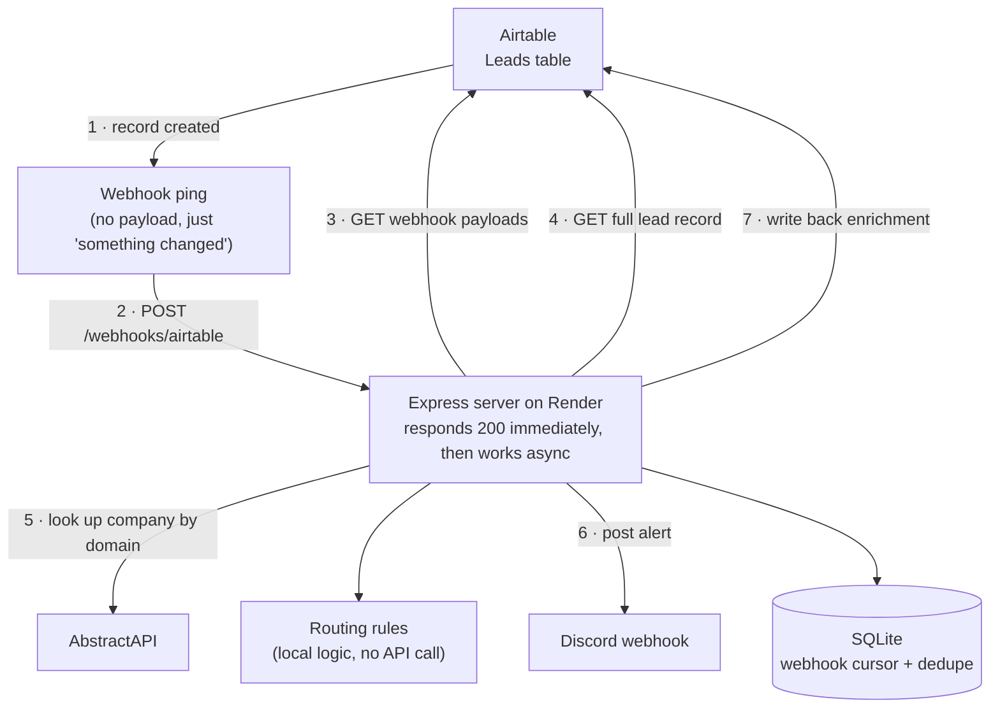

# Lead Enrichment Pipeline

Portfolio project demonstrating custom API integration work. When a new lead
lands in Airtable, the pipeline enriches it with company data, alerts the
right sales channel in Discord with a suggested next action, and writes the
enrichment data back onto the lead record. No human touches any of it.

Built as a standalone project on personal, free-tier accounts.

## Why this stack

| Role | Platform | Notes |
|---|---|---|
| Lead source + writeback | Airtable (personal free account) | Real Webhooks API, ping-then-pull instead of direct payload delivery |
| Company enrichment | AbstractAPI Company Enrichment | Simple API-key auth, generous-enough free tier |
| Sales alert | Discord Incoming Webhooks | One webhook URL per routing bucket, no OAuth needed |

The "Known tradeoffs" section below covers what each of these choices costs.

## Architecture



Step by step, matching the numbers in the diagram:

1. A row gets added to the `Leads` table.
2. Airtable pings the server's webhook endpoint. The ping carries no data, just notice that something changed.
3. The server asks Airtable what actually happened, using the webhook's own payload feed.
4. The server fetches the full lead record by ID.
5. The server looks up the lead's company by email domain against AbstractAPI, then routing rules decide which bucket it falls into and what a rep should do next. That decision never leaves the server; no API call is involved.
6. The server posts a formatted alert to the Discord channel that matches the bucket.
7. The server writes the enrichment and suggested action back onto the lead record.

Throughout, a small SQLite database tracks the webhook cursor and which
leads have already been processed, so a redelivered ping doesn't alert or
enrich the same lead twice.

A few design choices worth calling attention to:

- **Ack-then-process.** The webhook handler responds `200` before doing any
  real work. Airtable, like most webhook senders, treats a slow response as
  a failure and retries, and free-tier hosts can add cold-start latency on
  top of that.
- **Ping-then-pull.** Airtable's webhook only signals that something
  changed; the actual diff comes from a separate authenticated call. A
  cursor persisted in SQLite keeps a server restart from replaying the
  whole webhook history.
- **Business logic lives on its own.** Routing and next-action rules
  (`src/services/routingRules.js`) make zero API calls, so they can be
  reasoned about and tested without Airtable, AbstractAPI, or Discord being
  reachable at all.

## Live demo

The pipeline runs at [api-project-pve5.onrender.com](https://api-project-pve5.onrender.com),
with a public dashboard showing real leads as they're enriched and routed.
Add a row to the Airtable base and it shows up there within a few seconds.

## Project structure

```
src/
  config/env.js              Loads and validates env vars, single source of truth
  integrations/
    airtable.js               Airtable API client: payloads, lead records, webhook management
    enrichment.js              AbstractAPI client
    discord.js                 Discord webhook poster
  routes/
    airtableWebhook.js         POST /webhooks/airtable: verifies the signature, acks fast, hands off
    dashboard.js                GET /api/leads: sanitized, cached read for the public dashboard
  services/
    leadProcessor.js           Orchestrates the end-to-end sequence per webhook ping
    routingRules.js            Pure business logic: which channel, what next action
  lib/
    dedupe.js                  SQLite-backed cursor and processed-record tracking
    errors.js, retry.js, logger.js   Shared error type, backoff, structured logging
  jobs/
    refreshWebhook.js          Keeps the Airtable webhook subscription from expiring
  server.js                    Express app entry point
public/
  dashboard.html               Static page behind the live demo
scripts/
  setupWebhook.js               One-off: registers the Airtable webhook, prints the MAC secret to save
```

## Setup

1. `cp .env.example .env` and fill in the Airtable PAT, base ID, table ID,
   and AbstractAPI key. Discord webhook URLs and the Airtable webhook
   ID/secret come later, once those exist.
2. `npm install`
3. Create the Airtable base with a `Leads` table: `Name`, `Email`, `Company`,
   plus the writeback fields listed in `src/integrations/airtable.js`
   (`Industry`, `Company Size`, `Suggested Next Action`, `Enriched At`,
   `Enrichment Source`).
4. Create a Discord server with a few channels (`#enterprise-leads`,
   `#smb-leads`, `#unknown-leads`), add an Incoming Webhook to each, and
   drop the URLs into `.env`.
5. Deploy the server so it has a public HTTPS URL, then run
   `npm run setup-webhook` to register the Airtable webhook against that
   URL. Save the returned webhook ID and MAC secret into `.env` and into
   the host's environment variables.
6. Schedule `npm run refresh-webhook` to run periodically (see
   `src/jobs/refreshWebhook.js`) so the webhook subscription doesn't lapse.

## Known tradeoffs

- **SQLite on ephemeral disk.** Most free hosting tiers wipe local disk on
  restart or redeploy, resetting the dedupe log and webhook cursor. Fine
  for a demo; a hosted Postgres instance (Supabase's free tier, say) would
  be the move for anything longer-lived.
- **Airtable webhook expiry.** Subscriptions lapse after about a week
  without a refresh call. `src/jobs/refreshWebhook.js` handles the call
  itself, but something still has to schedule it, or the pipeline goes
  quiet without warning.
- **AbstractAPI's free tier quota is small.** Fine for a demo, not for real
  traffic. Personal and generic email domains will also legitimately come
  back with no company data; the routing logic treats that as an expected
  outcome (the `unknown` bucket), not an error.
- **Discord alerts use static, per-channel webhook URLs instead of a bot.**
  That means the set of routing buckets is fixed at deploy time. A real bot
  (a Developer Portal app with a bot token, posting through the REST API)
  would allow choosing channels at runtime, at the cost of more setup.
- **No OAuth anywhere in this version.** Airtable and AbstractAPI both use
  plain token or API-key auth, and Discord's webhook URL is itself the
  credential. A deliberate choice for a single-account portfolio project,
  and one worth being able to speak to: a multi-tenant version would need
  the full OAuth dance instead.

## License

[MIT](LICENSE)
